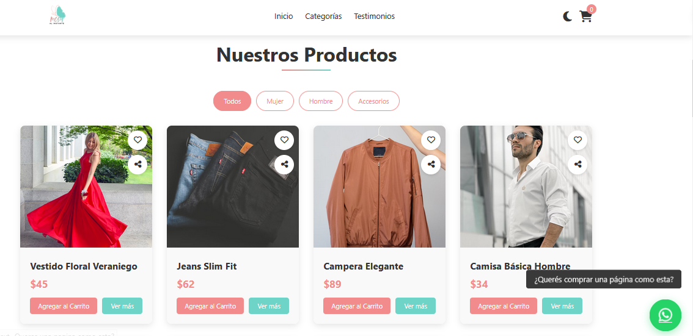

# 👗 Moda al Instante

**Moda al Instante** es una **tienda online ficticia de ropa y accesorios** desarrollada con **HTML, CSS y JavaScript puro**.  
El objetivo de este proyecto es mostrar un sitio moderno, interactivo y completamente funcional para **demostrar habilidades en desarrollo frontend, diseño web y experiencia de usuario.**

## 🌐 Demo

## 🛍️ Descripción

Este proyecto recrea la experiencia de una **tienda de moda online** con navegación fluida, catálogo dinámico, testimonios, formulario de suscripción y un carrito de compras totalmente funcional.  
Fue diseñado con un enfoque profesional y adaptable para **desktop y dispositivos móviles**, simulando un e-commerce real con un toque personal y visualmente atractivo.

## 📸 Captura de Pantalla

## 💡 Características principales

* 🧥 Catálogo de productos dividido por **categorías** (Mujer, Hombre, Accesorios).  
* 💬 **Slider de testimonios** de clientes con animaciones suaves.  
* 🛒 **Carrito de compras dinámico** con actualización en tiempo real.  
* 🌙 **Modo oscuro/claro** activable con un botón de alternancia.  
* ⚡ **Pantalla de carga animada** al iniciar el sitio.  
* 💌 **Formulario de suscripción** con validación.  
* 📱 **Diseño 100% responsive**, adaptable a cualquier tamaño de pantalla.  
* 🧩 **Popup de producto** con selector de talle, cantidad y precio.  
* 📞 **Botón flotante de WhatsApp** para contacto rápido.  
* 🧠 Código estructurado, optimizado y fácil de mantener.

## 📂 Estructura del proyecto
### │── index.html
### │── assets
###      │── facebook-logo.png
###      │── fiverr-logo.png
###      │── git-hub-logo.png
###      │── linkedin-logo.jpg
###      │── logo.png
###      └── reddit-logo.png
### │── css
###      └── styles.css
### │── js
###      └── script.js
### │── preview.png
### └── README.md

## 🛠️ Tecnologías utilizadas

* **HTML5** → Estructura semántica y accesible del sitio.  
* **CSS3** → Estilos, animaciones, modo oscuro y diseño responsive.  
* **JavaScript** → Lógica de interacción, manejo del carrito, loader, popup y testimonios.  
* **Font Awesome** → Íconos para interfaz, redes sociales y botones.  

## 📦 Funcionalidades JavaScript destacadas

* Generación dinámica de productos y testimonios.  
* Manejo de carrito con almacenamiento en memoria.  
* Popup de producto con selección de talle y cantidad.  
* Control de categorías con botones filtrables.  
* Sistema de notificaciones personalizadas.  

## 👨‍💻 Desarrollador

Proyecto desarrollado por **Thomas Ramírez**, Desarrollador Web Frontend especializado en **Landing Pages Profesionales, SEO y Marketing Digital.**  
Creado como ejemplo demostrativo para su portafolio y para mostrar sus capacidades técnicas y de diseño.

## Redes sociales: 
[LinkedIn](https://www.linkedin.com/in/thomas-alan-ramirez/) | [Fiverr](https://es.fiverr.com/aramirezthomas?public_mode=true) | [Facebook](https://www.facebook.com/profile.php?id=61575025664166) | [Reddit](https://www.reddit.com/user/Late-Put-9295/)

## 🤝 Disponible para contratación
¿Querés una página igual de profesional para tu estudio o servicio?  
Podés obtener una **landing page como esta en mi perfil de Fiverr por solo $10 USD**.  
👉 [Visitar mi Fiverr](https://es.fiverr.com/s/1qv4kdp)

## ⚠️ Aviso Legal

> Este sitio web es un **proyecto ficticio** sin fines comerciales.  
> Todos los nombres, precios y productos son de carácter demostrativo.  

## 📝 Licencia

Este proyecto está bajo la **MIT License**.  
Libre para usar, modificar y compartir.

## ⭐ ¿Te gustó el proyecto?

Si te gustó **Moda al Instante**, ¡dejá una ⭐ en GitHub y compartilo!  
Inspirate, modificá y usalo para crear tu propia tienda online.

# ✨ ¡Gracias por visitar **Moda al Instante**! 👠👜